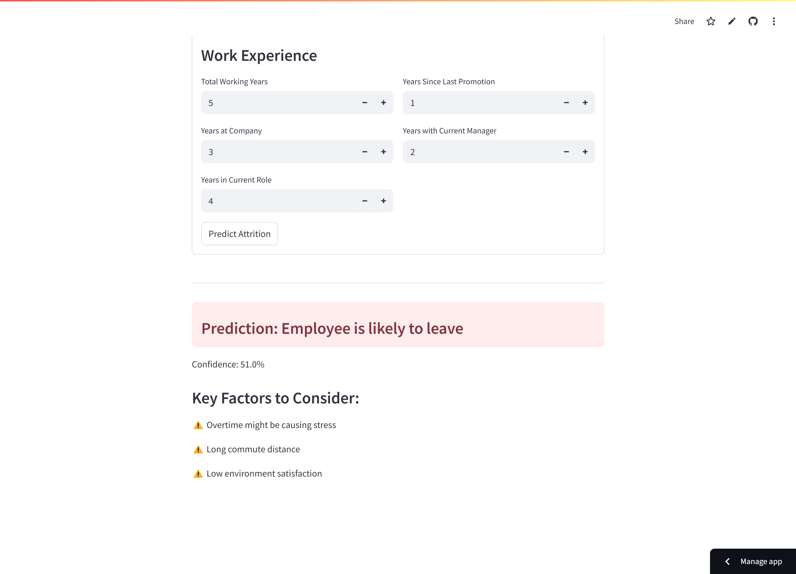
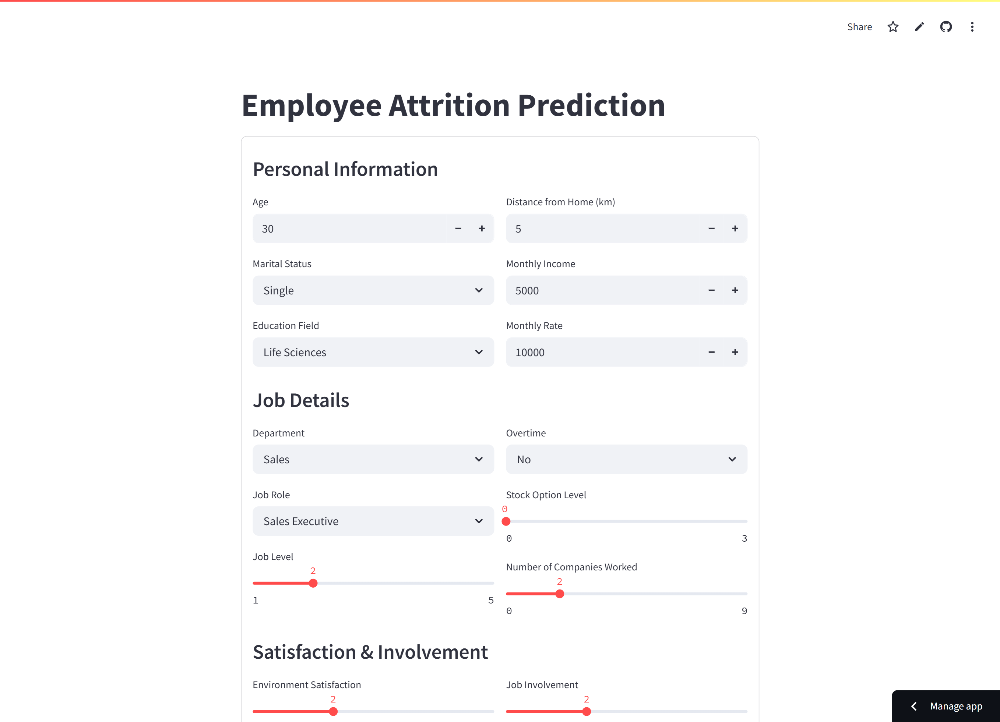

---

# Employee attrition prdiction

🚀 [Click here to try the live Streamlit app](https://employee-attrition-forecast.streamlit.app/)  

## 🔍 App Preview




## 📌 Project Overview
The goal of this project is to predict employee attrition (whether an employee will leave the company) using machine learning models. The dataset contains various employee-related features such as job satisfaction, monthly income, years at the company, and more.

---

## 📂 Folder Structure
```
Employee attrition 
├── Data                  # Contains datasets (CSV files)
│   ├── Employee-Attrition.csv
│   ├── Preprocess-Dataset.csv
│
├── notebooks             # Jupyter/Colab notebooks for data exploration & model training
│   ├── Model training.ipynb
│   ├── Preprocessing.ipynb
│
├── src                   # Python scripts for preprocessing & model training
│   ├── attrition.py
│
├── models                # Saved trained models
│   ├── model(rf).pkl
│
├── docs                  # Project documentation
│   ├── report.pdf
│
├── Images                # Visualization images
│   ├── model_comparison.png
│   ├── class_distribution.png
│   ├── best_model_confusion_matrix.png
│
├── README.md             # Project description
├── requirements.txt      # Required Python libraries
├── LICENSE               # Open-source license
```

---

## 📊 Dataset Information

- **Dataset Source:** [Kaggle - WA_Fn-UseC_-HR-Employee-Attrition](https://www.kaggle.com/datasets/mohamedmahmoud153/wa-fn-usec-hr-employee-attrition)

The dataset contains several employee-related features believed to influence attrition. These features are organized as follows:

### Feature Categories:
  - Age
  - Gender
  - MaritalStatus
  - Department
  - JobRole
  - JobLevel
  - JobSatisfaction
  - YearsAtCompany
  - MonthlyIncome
  - DailyRate
  - PercentSalaryHike
  - WorkLifeBalance
  - OverTime
  - BusinessTravel
  - YearsSinceLastPromotion
  - YearsWithCurrManager

### Target Variable:
- **Attrition:** Binary classification target variable
  - **Yes**: Employee left the company.
  - **No**: Employee is still with the company.

---

## 🔑 Key Features
The following features are considered crucial for predicting employee attrition:

- **Demographics:** Age, Gender, MaritalStatus
- **Job-Related:** Department, JobRole, JobLevel, JobSatisfaction, YearsAtCompany
- **Compensation:** MonthlyIncome, DailyRate, PercentSalaryHike
- **Work-Life:** WorkLifeBalance, OverTime, BusinessTravel
- **Tenure Metrics:** YearsSinceLastPromotion, YearsWithCurrManager

---

## 🔍 Notable Insights

### **Attrition Drivers:**
Several factors are likely to influence employee attrition, including:
- **Low Job Satisfaction**: Employees with lower job satisfaction are more likely to leave.
- **Overtime**: Employees working overtime regularly may experience burnout and higher attrition.
- **Limited Promotion Opportunities**: Employees with fewer opportunities for promotion tend to leave more frequently.
- **Work-Life Imbalance**: Employees reporting poor work-life balance may be more likely to leave.

### **High-Risk Groups:**
Employees in the following groups may be at a higher risk for attrition:
- Frequent business travelers.
- Employees in lower job levels or positions.
- Employees with shorter tenures, particularly those with less than a few years at the company.

---

## 📌 Implementation Steps
### **1️⃣ Data Preprocessing**
- **Handling Missing Values** (if any)
- **Feature Scaling** using StandardScaler and LabelEncoder(for one-hot)
- **Splitting Data** into training and testing sets
- **Encoding Target Variable** (Converting into classification problem)

### **2️⃣ Model Training**
We implemented **6 ML models**:
- **Logistic Regression** 📉
- **Random Forest** 🌳
- **K-Nearest Neighbors (KNN)** 🔍
- **Decision Tree** 🌿
- **Gradient Boosting** 📈
- **Support Vector Classifier (SVC)** 🏹

### **3️⃣ Model Evaluation**
- **Accuracy Score**
- **Precision, Recall, and F1-Score**

---

## 🛠️ Requirements
All required Python libraries are listed in `requirements.txt`.

```
pandas>=1.3.0
scikit-learn>=1.0.0
matplotlib>=3.4.0
seaborn>=0.11.0
numpy>=1.21.0
scipy>=1.7.0
joblib>=1.0.0
```

Install them using:
```
pip install -r requirements.txt
```


---

## 🔄 How to Clone This Repository
To clone this repository, follow these steps:

1. **Open a Terminal or Command Prompt.**
2. **Run the Clone Command:**
   ```bash
   git clone https://github.com/<your-username>/Employee-attrition.git
   ```
   Replace `<your-username>` with your actual GitHub username.
3. **Navigate to the Project Directory:**
   ```bash
   cd Employee-attrition
   ```
4. **Install the Required Dependencies:**
   ```bash
   pip install -r requirements.txt
   ```
5. **Run the Application:**
   For local testing:
   ```bash
   python src/attrition.py
   ```

---
